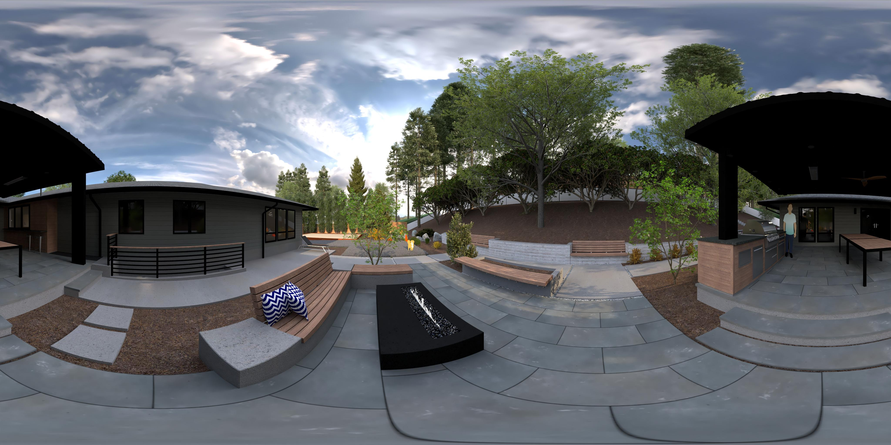

# archviz-vr-tools
Collection of tools for architectural visualization virtual reality workflow optimization.



# mkvrjpg.py
Some photorealistic rendering tools with create stere output, but they often come in simple image form which require some post processing to view them as photospheres or as stereoscopic photospheres in a VR headset.

mkvrjpg.py assembles a stereoscopic jpeg image from left and right eye jpeg images.  These images can be separate files, or a single image with both images, either stacked (left on top) or side by side (left on the left). It sets the required XMP properties and embeds the two images which allows the image to be viewed in any image viewer (left eye image), as well as in photosphere viewers such as the Google Photos web viewer, and in stereoscopic VR viewers, such as Google Carboard and Google Daydream.

## Installation
### Mac OS
You will first need to install python 3 and homebrew, see the respective links
and follow the instructions to install before proceeding.

From a terminal, install the dependencies:
```
$ brew install exempi
$ pip3 install pillow python-xmp-toolkit
```

Copy the mkvrjpg.py script to your PATH, such as /usr/local/bin.
`$ sudo cp mkvrjpg.py /usr/local/bin/`

### Linux
Some packages are likely available from your distribution, such as python3, python3-pillow, and exempi.

You will most likely need to use pip to install python-xmp-toolkit.

#### Fedora
`$ sudo dnf install python3 python3-pillow exempi`

#### PIP
`$ pip3 install python-xmp-toolkit`

## Usage
Use the `-h` (or `--help`) option to display help on basic usage.
```
$ ./mkvrjpg.py -h
Usage: mkvrjpg.py [OPTIONS] [stereo_img || left_img right_img]
  -h, --help          display this help and exit
  -l, --left          left eye image
  -o, --out           output image
  -r, --right         right eye image
  -s, --stereo        stereo image
```
### Input
Photospheres should be made up of two images with a 2:1 aspect ratio. Stereo
images cat be stacked (left on top) in a 1:1 aspect ratio, or side by side (left
on the left) in a 4:1 aspect ratio. Stereo images will be split into two
temporary left and right eye images with a 2:1 aspect ratio.

You can view all of these images in the [archviz-vr-tools Google Photo
album](https://photos.app.goo.gl/o4oUkH1tRV9tmzsMA), including the [Stereoscopic VR Image](https://photos.app.goo.gl/uk86WRRDJJUQxmNK8) using a Cardboard or Daydream headset.

#### Left or Right Eye


#### Stereo Stacked


#### Stereo Side by Side


### Examples
mkvrjpg.py will operate on either left and right eye image pairs or on single
stereo images. It will accept positional arguments, or allow you to use the
documented options to explicitly specify each input image.

#### Create a VR image from a stereo image
If your input image is a single stereo image in either stacked or side by side
format, mkvrjpg.py will split it into the required left and right eye images
automatically.

```
$ mkvrjpg.py stereo.jpg
VR Image saved to: /Users/dvhart/source/archviz-vr-tools/mkvrjpg-fkwg9wt_.vr.jpg
```
This is equivalent to:
```
$ mkvrjpg.py -s stereo.jpg
VR Image saved to: /Users/dvhart/source/archviz-vr-tools/mkvrjpg-peblq_9e.vr.jpg
```
#### Create a VR image from a left and right eye image pair
```
$ mkvrjpg.py left.jpg right.jpg
VR Image saved to: /Users/dvhart/source/archviz-vr-tools/mkvrjpg-vo051rxk.vr.jpg
```
This is equivalent to:
```
$ mkvrjpg.py -l left.jpg -r right.jpg
VR Image saved to: /Users/dvhart/source/archviz-vr-tools/mkvrjpg-irgm8_98.vr.jpg
```

#### Specify the output image
You can specify the output filename with the `-o` option. Note that it must come
before any position arguments, but can appear in any order relative to other
options. A `.vr.jpg` suffix is recommended for viewer compatibility.

```
$ mkvrjpg.py -o output.vr.jpg stereo.jpg
VR Image saved to: output.vr.jpg
```
This is equivalent to:
```
$ mkvrjpg.py -s stereo.jpg -o output.vr.jpg
VR Image saved to: output.vr.jpg
```
